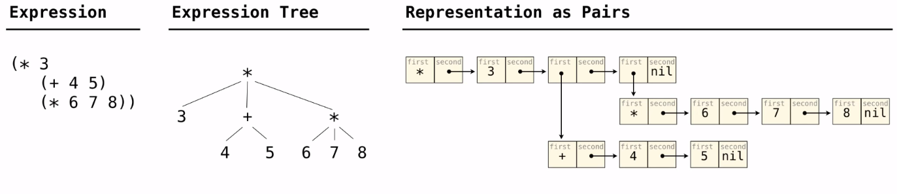

# Lecture
## Programming Languages
A computer typically executes programs written in many different programming languages.
**Machine languages**: statements are interpreted by the hardware itself
- A fixed set of instructions invoke operations implemented by the circuitry of the central processing unit(CPU)
- Operations refer to specific hardware memory addresses; no abstraction mechanisms

**High-level languages**: statments & expressions are interpreted by another program or compiled (translated) into another language
- Provide means of abstraction such as naming, function definnition, and objects
- Abstract away ststem details to be independent of hardware and operating system
- Interpreting involves reading the program and executing its behavior.
- Compiling involves translating it into another langugage, such as machine language, so it can be executed later

## Metalinguistic Abstraction
A powerful form of abstraction is to define a new language that is tailored to a particular type of application or problem domain.

**Type of application:** Erlang was designed for concurrent programs. It has built-in elements for expressing concurrent communication. It is used, for example, to implement chat servers with many simultaneous connections.

**Problem domain:** The MediaWiki mark-up alngugae was designed for generating static web pages. It has built-in elements for text formatting and cross-page linking. It is used, for example, to creat Wikipedia pages.

A programming language has:
- **Syntax:** The legal statements and expressions in the language
- **Semantics:** The execution/evaluation rule for those statements and expressions

To create a new programming language, you either need a:
- **Specification:** A document describe the precise syntax and semantics of teh language
- **Canonical Implementation:** An interpreter or compiler for the langugage

## Parsing
A parser takes text and returns an expression.

<p style="text-align: center;">Text => Lexical analysis => Tokens => Syntactic analysis => Expression</p>

### Lexical analysis
- Iterative process
- Checks for malformed tokens
- Determines types of tokens
- Processes one line at a time

### Expression
- Tree-recursive process
- Balances parentheses
- Returns tree structure
- Processes multiple lines

### Recursive Syntactic Analysis
A predictive recursive descent parser inspects only *k* tokens to decide how to proceed, for some fixed *k*.
> English can not be handled using this

### Syntactic Analysis
- Syntactic analysis identifies the hierarchical structure of an expression, which may be nested.
- Each call to scheme_read consumes the input tokens for exactly one exression.
- **Base case:** symbols and numbers
- **Recursive call:** scheme_read sub-expressions and combine them

## Calculator
### The Pair Class
The Pair class represents Scheme pairs and lists. A list is a pair whose second element is either a list or nil.
```py
class Pair:
    """ A Pair has two instance attributes:
    first and second.

    For a Pair to be a well-formed list,
    second is either a swell-formed list or nil.
    Some methods only apply to well-formed lists.
    """
    def __init__(self, first, second):
        self.first = first
        self.second = second
```
Scheme expressions are represented as Scheme lists! Homoiconic means source code is data.

### Calculator Syntax
The Calculator language has primitive expressions and call expressions.
- A primitive expression is a number: 2, -4, 5.6
- A call expression is a combination that begins with an operator (+, -, *, /) followed by 0 or more expressions.
- Expressions are represented as Scheme lists (Pair instances) that encode tree structures.



### Calculator Semantics
The value of a calculator expression is defined recursively.
- **Primitive:** A number evaluates to itself.
- **Call:** A call expression evaluates to its argument values combined by an operator.
  - +: sum of the arguments
  - *: product of the arguments
  - -: if one argument, negate it. If more than one, subtract the rest from the first.
  - /: if one argument, negate it. If more than one, divide the rest from the first.

### The Eval Function
- The eval function computes the valu of an expression, which is always a number.
- It is a generic function that dispatches on the type of the expression (primitive or call)
```py
def calc_eval(exp):
    if type(exp) in (int, float):                   # A number evaluates to itself
        return exp
    elif isinstance(exp, Pair):                     # A call expression evaluates to its argument values recursively...
        arguments = exp.second.map(calc_eval)       #   combined by an operator
        return calc_apply(exp.first, arguments)
    else:
        raise TypeError
```

### Applying Built-in Operators
- The apply function applies some operatiion to a (Scheme) list of argument values.
- In calculator, all operations are named by built-in operators: +, -, *, /
```py
def calc_apply(operator, args):
    if operator == '+':
        return reduce(add, args, 0)
    elif operator == '-':
        ...
    ...
    else:
        raise TypeError
```

### Interactive Interpreters
#### Read-Eval-Print Loop
the user interface for many programming languages is an interactive interpreter.
- Print a prompt.
- **Read** text input from the user.
- Parse the text input into an expression.
- **Evaluate** the expression.
- If any errors occur, report those errors, otherwise
- **Print** the value of the expression and repeat.

#### Raising Exceptions
Exceptions are raised within lexical analysis, syntactic analysis, eval, and apply.

*Example exceptions*
- **Lexical analysis:** The token 2.3.4 raises ValueError("invalid numeral")
- **Syntactic analysis:** An extra ) raises SyntaxError("unexpected token")
- **Eval:** An empty combination raises TypeError("() is not a number or call expression")
- **Apply:** No arguments to - raises TypeError("- requires at least 1 argument")

#### Handling Exceptions
- An interactive interpreter prints information about each error.
- Should not halt completely on an error, so that the user has an opportunity to try again in the current environment.

## Q&A
- 01:48​ Why does .pop() remove from the beginning instead of the end in scheme_read?
  - src is a Buffer instance. It pops the first.
- 03:37​ What happens after reaching a base case in scheme_read?
- 05:56​ How do you peek at the next item in an iterator without removing it?
  - Standerd iterator cannot do it.
- 07:49​ What does the line exp.second.map(calc_eval) do in the calc_eval function?
- 11:21​ When a recursive function takes a Pair as its argument, should it always use map to make recursive calls?
- 14:14​ Would a Python parser need to track whitespace and indentation?
  - Yes, it needs.
- 16:03​ What languages are used to write interpreters?
  - If you need speed and resource use, at the time of python was invented, C was the obvious choice. Now the fastest of implementation of python is py-py, which is a python interpreter written in python. It is quite a bit faster than the interpreter written in C.
  - A natural trend is that ppl will write a interpreter for a language using the language they write interpreter for.
  - John choose an evloved version of Scheme called racket.
  - If you need speed up python, there is a language called cython.
- 20:12​ To run an interpreter for Python written in Python, don't you need an interpreter written in some other language?
  - Yes. But once you done that, you can use the interpreter part from the language.
- 23:22​ When did 61A switch from Scheme to Python?
- 24:32​ What factors do you consider when picking a language for a project?
  - Farid said that he always uses python or matlab in research project. Because there are lot of libraries. If he needs speed, he will first write it in python then transfer it to C. Scale is also the thing you need consider. If you need cross platform, java is a good choice.
  - John said what you need is the language that will solve the most problems you'll encounter. He write a lot python this day.
- 28:31​ How does the text typed by a user get presented to the program that interprets it?

# Ch. 3.4 Interpreters for Languages with Combination
An interpreter for a programming language is a function that, when applied to an expression of the language, performs the actions required to evaluate that expression.

## 3.4.2 Expression Trees
In order to write an interpreter, we must operate on expressions as data.

**Scheme Pairs**:
- In Scheme, lists are nested pairs, but not all pairs are lists.
- The empty list is represented by an object called nil, which is an instance of the class nil. We assume that only one nil instance will ever be created.
```py
>>> s = Pair(1, Pair(2, nil))
>>> s
Pair(1, Pair(2, nil))
>>> print(s)
(1 2)

>>> len(s)
2
>>> s[1]
2
>>> print(s.map(lambda x: x+4))
(5 6)
```

## 3.4.3 Parsing Expressions
- Parsing is the process of generating expression trees from raw text input. 
- A parser is a composition of two components: a lexical analyzer and a syntactic analyzer. 
  - First, the *lexical analyzer* partitions the input string into tokens, which are the minimal syntactic units of the language such as names and symbols. 
  - Second, the *syntactic analyzer* constructs an expression tree from this sequence of tokens. 
- The sequence of tokens produced by the lexical analyzer is **consumed** by the syntactic analyzer.

**Lexical analysis.** The component that interprets a string as a token sequence is called a tokenizer or lexical analyzer.
- the tokenizer is a function called *tokenize_line* in [scheme_tokens](http://composingprograms.com/examples/scalc/scheme_tokens.py.html).
- Scheme tokens are delimited by delimiters, which are tokens, as are symbols and numerals. (white space, parentheses, dots, or single quotation marks.)
- Tokenizing a well-formed Calculator expression separates all symbols and delimiters, but identifies multi-character numbers (e.g., 2.3) and converts them into numeric types.
```py
>>> tokenize_line('(+ 1 (* 2.3 45))')
['(', '+', 1, '(', '*', 2.3, 45, ')', ')']
```
- Lexical analysis is an iterative process, and it can be applied to each line of an input program in isolation.

**Syntactic analysis.** The component that interprets a token sequence as an expression tree is called a syntactic analyzer.
- a tree-recursive process, and it must consider an entire expression that may span multiple lines.
- implemented by the *scheme_read* function in [scheme_reader](http://composingprograms.com/examples/scalc/scheme_reader.py.html).
- The *scheme_read* function expects its input *src* to be a *[Buffer](http://composingprograms.com/examples/scalc/buffer.py.html)* instance that gives access to a sequence of tokens.
```py
>>> lines = ['(+ 1', '   (* 2.3 45))']
>>> expression = scheme_read(Buffer(tokenize_lines(lines)))
>>> expression
Pair('+', Pair(1, Pair(Pair('*', Pair(2.3, Pair(45, nil))), nil)))
>>> print(expression)
(+ 1 (* 2.3 45))
```
- The *scheme_read* function first checks for various base cases. 
  - A recursive call to *read_tail* is invoked whenever a *(* token indicates the beginning of a list.
  - only read well-formed Scheme lists, which are all we need for the Calculator language.
- The *read_tail* function continues to read from the same input src, but expects to be called after a list has begun. 
  - Its recursive call reads the first element of the list with scheme_read,
  - reads the rest of the list with read_tail, 
  - and then returns a list represented as a Pair.
- Informative syntax errors improve the usability of an interpreter substantially. The SyntaxError exceptions that are raised include a description of the problem encountered.

## 3.4.4 Calculator Evaluation
- The Calculator language is simple enough that we can easily express the logic of applying each operator in the body of a single function.
  - One clause, one operator
- The *calc_apply* function can be applied directly, but it must be passed a list of *values* as arguments rather than a list of *operand expressions*.
  - *calc_eval* make calls to *calc_apply* by first computing the value of operand sub-expressions before passing them as arguments to *calc_apply*.
- The structure of *calc_eval* is an example of *dispatching* on type
- Primitive expressions that do not require an additional evaluation step are called *self-evaluating*.

**Read-eval-print loops.** A typical approach to interacting with an interpreter is through a read-eval-print loop, or REPL.
```py
def read_eval_print_loop():
    """Run a read-eval-print loop for calculator."""
    while True:
        try:
            src = buffer_input()
            while src.more_on_line:
                expression = scheme_read(src)
                print(calc_eval(expression))
        except (SyntaxError, TypeError, ValueError, ZeroDivisionError) as err:
            print(type(err).__name__ + ':', err)
        except (KeyboardInterrupt, EOFError):  # <Control>-D, etc.
            print('Calculation completed.')
            return
```
> This loop implementation reports errors without exiting the loop. Rather than exiting the program on an error, restarting the loop after an error message lets users revise their expressions.
> 
> Upon importing the *readline* module, users can even recall their previous inputs using the up arrow or Control-P. The final result provides an informative error reporting interface:
> 
> we will see that the read_eval_print_loop is parameterized by a parsing function, an evaluation function, and the exception types handled by the try statement. 
