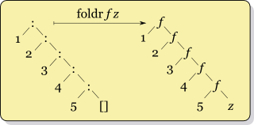

# Lecture
## Macros Perform Code Transformations
- A macro is an operation performed on the source code of a program before evaluation.
- Macros exist in many languages, but are easiest to define correctly in a language like Lisp
- Scheme has a *define-macro* special form that defines a source code transformation
```scheme
(define-macro (twice expr) (list 'begin expr expr))

scm> (twice (print 2))
2
2
```
Evaluation procedure of a macro call expression:
- Evaluate the operator sub-expression, which evaluates to a macro
- Call the macro procedure on the operand expressions *without evaluating them first*
- Evaluate the expression returned from the macro procedure

> Macros take in a expression and return eval(macroed_expression), instead of taking in values and returning values.

```scheme
scm> (define (twice expr) (list 'begin expr expr))
twice
scm> (twice (print 2))
2
(begin undefined undefined)
scm> (twice '(print 2))
(begin (print 2) (print 2))
scm> (eval (twice '(print 2)))
2
2

scm> (define-macro (twice expr) (list 'begin expr expr))
twice
scm> (twice (print 2)) ; twice became a procedure without evaluating operand first, a macro.
2
2

;;;
scm> (define (check val) (if val 'passed 'failed))
check
scm> (define x -2)
x
scm> (check (> x 0))
failed

scm> (define-macro (check expr) (list 'if expr ''passed ''failed)) ; make it a list will unquote a quote
check
scm> (check (> x 0))
failed

scm> (define-macro (check expr) (list 'if expr ''passed (list 'quote (list 'failed: expr))))
check
scm> (check (> x 0))
(failed: (> x 0)) ; this is the difference macro made

;misc
scm> (define-macro (check expr) (list 'if expr ''passed (list quote (list 'failed: expr)))) ; I don't know why quote is not a procedure until you ' it.
check
scm> (check (> x 0))
Traceback (most recent call last):
 0	(check (> x 0))
 1	(list (quote if) expr (quote (quote passed)) (list quote (list (quote failed:) expr)))
 2	(list quote (list (quote failed:) expr))
 3	quote
Error: unknown identifier: quote

scm> (define-macro (check expr) (list 'if expr ''passed ''(list 'failed: expr)))
check
scm> (check (> x 0))
(list (quote failed:) expr) ; you can only quote a single head list

scm> (define-macro (check expr) (list 'if expr ''passed (list ''failed: expr)))
check
scm> (check (> x 0))
Traceback (most recent call last):
 0	(check (> x 0))
 1	((quote failed:) (> x 0))
Error: str is not callable: failed: ; interpreter will read it as a function call
```

## For Macro
```scheme
(define-macro (for sym vals expr)
    (list 'map (list 'lambda) (list sym) expr) vals)
```

## Lab 14
When we write recursive functions acting on Links, we often find that they have the following form:
```py
def func(link):
    if link is Link.empty:
        return <Base case>
    else:
        return <Expression involving func(link.rest)>
```
In the spirit of abstraction, we want to factor out this commonly seen pattern. It turns out that we can define an abstraction called *fold* that do this.

A linked list can be represented as a series of *Link* constructors, where *Link.rest* is either another linked list or the empty list.

We represent such a list in the diagram below:



In this diagram, the recursive list

    Link(1, Link(2, Link(3, Link(4,Link(5)))))
is represented with *:* as the constructor and *[]* as the empty list.

We define a function *foldr* that takes in a function *f* which takes two arguments, and a value *z*. foldr essentially replaces the *Link* constructor with *f*, and the empty list with *z*. It then evaluates the expression and returns the result. This is equivalent to:

    f(1, f(2, f(3, f(4, f(5, z)))))
We call this operation a right fold.

Similarly we can define a left fold *foldl* that folds a list starting from the beginning, such that the function f will be applied this way:

    f(f(f(f(f(z, 1), 2), 3), 4), 5)


Also notice that a left fold is equivalent to Python's *reduce* with a starting value.

```py
identity = lambda x: x

def foldl2(link, fn, z):
    """ Write foldl using foldr
    >>> list = Link(3, Link(2, Link(1)))
    >>> foldl2(list, sub, 0) # (((0 - 3) - 2) - 1)
    -6
    >>> foldl2(list, add, 0) # (((0 + 3) + 2) + 1)
    6
    >>> foldl2(list, mul, 1) # (((1 * 3) * 2) * 1)
    6
    """
    def step(x, g):
        "*** YOUR CODE HERE ***"
        return lambda z: g(fn(z, x))
    return foldr(link, step, identity)(z)
```