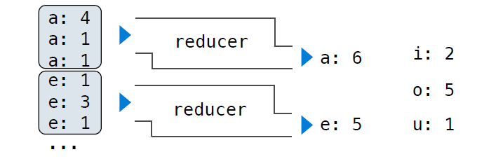

# Lecture
## Comupter Systems
Systems research enables application development by defining and implementing abstractions:
- **Operating systems** provide a stable, consistent interface to unreliable, innconsisitent hardware
- **Networks** provide a robust data transfer interface to constantly evolving communications infrastructure
- **Databases** provide a declarative interface to complex software that stores and retrieves information efficiently
- **Distributed systems** provide a unified interface to a cluster of multiple machines

A unifying property of effective systems:
> Hide complexity, but retain flexibility

### Example: The Unix Operating System
Essential features of the Unix operating system (and variants):
- *Portability*: The same operating system on different hardware
- *Multi-Tasking*: Many processes run concurrently on a machine
- *Plain Text*: Data is stored and shared in text format
- *Modularity*: Small tools are composed flexibly via pipes

"We should have some ways of coupling programs like a garden hose - screw in another segment when it becomes necessary to massage data in another way," Doug McIlroy in 1964.


The standard streams in a Unix-like operating system are similar to Python iterators

### Python Programs in a Unix Environment
- The *sys.stdin* and *sys.stdout* values provide access to the Unix standard streams as files
- A Python file has an interface that supports iteration, *read*, and *write* methods
- Using these "files" takes advantage of the operating system text processing abstaction
- The *input* and *print* functions also read from standard input and write to standrd output

```py
import sys

for line in sys.stdin:
    sys.stdout.write(' '.join(line))
```
```
~/CS61A/34. Distributed Data$ python3 ex.py
Here it is
H e r e   i t   i s 

~/CS61A/34. Distributed Data$ ls | python3 ex.py
e x . p y
```

## Big Data
### Big Data Examples
- Facebook's daily logs: 60 Terabytes
- 1,000 genomes project: 200 Terabytes
- Google web index: 10+ Petabytes
- Time to read 1 Terabyte from disk: 3 hours (100 Megabytes/second)

Typical hard ware for big data applications:
- Consumer-grade hard disks and processors
- Independent computers are stroed in racks
- Concerns: networking, heat, power, monitoring
- When using many computers, some will fail!

## Apache Spark
Apache Spark is a data processing system that provides a simple interface for large data
- A Resilient Distributed Dataset (RDD) is a collection of values or key-value pairs
- Supports common UNIX operations: sort, distinct (uniq in UNIX), count, pipe
- Supports common sequence operations: map, filter, reduce
- Supports common database operations: join, union, intersection

All of these operations can be performed on RDDs that are partitioned across machines

### Apache Spark Execution Model
Processing is defined centrally but executed remotely
- A Resilient Distributed Dataset (RDD) is distributed in partitions to worker nodes
- A *driver program* defines transformations and actions on an RDD
- A *cluster manager* assigns tasks to individual worker nodes to carry them out
- Worker nodes perform computation & communicate values to each other
- Final results are communicated back to the driver program


### Apache Spark Interface
```py
>>> sc                                      # A Sparkcontext gives access to the cluster manager
<pyspark.context.SparkContext ...>
>>> x = sc.textfile('shakespear.txt')       # A RDD can be constructed from the lines of a text file

>>> x.sortBy(lambda s: s, False).take(2)    # The sortBy transformation and take action are methods
# cat shakespear.txt | sort -r | head -n2
```

### What Does Apache Spark Provide
**Fault tolerance:** A machine or hard drive might crash
- The cluster manager automatically re-runs failed tasks

**Speed:** Some machine might be slow because it's overloaded
- The cluster manager can run multiple copies of a task and keep the result of the one that finishes first

**Netwrok locality:** Data transfer is expensive
- The cluster manager tries to schedule computation on the machines that hold the data to be processed

**Monitoring:**
- The cluster manager provides a web-based interface describing jobs

## MapReduce
### MapReduce Applications
An important early distributed processing system was MapReduce, developed at Google.

Generic application structure that happened to *capture many common data processing tasks*
1. Each element in an input collection produces zero or more key-value pairs (map)
2. All key-value pairs that share a key are aggregated together (shuffle)
3. The values for a key are processed as a sequence (reduce)

Early applications: indexing web pages, training language models, & computing PageRank

### MapReduce Evaluation Model
**Map phase:** Apply a *mapper* function to all inputs, emitting intermediate key-value pairs
- The mapper yields zero or more key-value pairs for each input


**Reduce phase:** For each intermediate key, apply a *reducer* function to accumulate all values associated with that key
- All key-value pairs with the same key are processed together
- The reducer yields zero or more values, each associated with that intermediate key


### MapReduce Applications on Apache Spark
Key-value pairs are just two-element Python tuples
| Call Expression      | Data            | fn Input   | fn Output                    | Result                                      |
| -------------------- | --------------- | ---------- | ---------------------------- | ------------------------------------------- |
| data.flatMap(fn)     | Values          | One value  | Zero or more key-value pairs | All key-value pairs returned by calls to fn |
| data.reduceByKey(fn) | Key-value pairs | Two values | One value                    | One key-value pair for each unique key      |

```py
def vowels(line):
    """Yield (vowel, count) pairs."""
    for v in 'aeiou':
        if v in line:
            yield (v, line.count(v))

>>> vowels('hello world')
<generator object vowels at 0x7fc6bc1c0120>
>>> list(vowels('hello world'))
[('e', 1), ('o', 2)]
>>> data.flatmap(vowels).take(10)

>>> from operator import add
>>> data.flatMap(vowels).reduceByKey(add).collect() # I believe that the two values input of fn uses the same mechanism as foldl, values here are values of the same key.